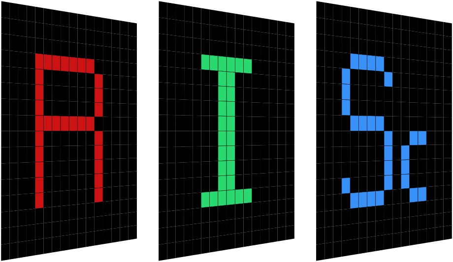

<div align="center">
  
</div>

---

This is the RISc Lab website, built using Atro with the Atrogon template.

## Features
- light/dark mode
- responsive layout
- searching for publications based on title

## Adding Content
Most of everything you will need to update is in the ```src/content``` and ```src/assets``` folders. 

- ```src/content``` : markdown files
- ```src/assets``` : images in ```.webp``` format

### Assets
- carousel: images that cycle in the banner carousel on the home page
- logos: RISc lab logos, as well as funding sources and collaborators
- news: images that correspond with news articles
- people: images that correspond with people cards
- publications/teasers: teaser images

### Content
Each individual item that you want to show needs its own ```.md``` file. The astro code automatically searches for all entries inside the subfolders, assembling them into a "Collection" object of the same name as the folder. No editing of the astro components needed (unless you want to tweak the style)!

- about: the "about" snippet that is displayed under the logo and image banner carousel
- awards: entries for each award
- home: initializes the home page
- news: news entries
- people: entries for each person, organized by degree type in subfolders
- publications: entries for each publication

The easiest way to create a new item is to copy an existing ```.md``` file and replace the content inside with the new information. The ```.md``` files each start with some frontmatter, followed by the body content like so:

``` bash
---
title: "Title"
description: "this is the description"
image: "@/assets/example.webp"
otherParams:
  link: "https://github.com"
  year: "2022"
---
Content
```
If you need to see what frontmatter variables exist and expect as input types, you can look at the ```config.ts``` file and find the relevant collection definition. For instance, if you put the wrong type in you may get an error that looks like this:

```bash
14:24:41 [ERROR] [InvalidContentEntryDataError] people → phd/quintonqu data does not match collection schema.
startYear: Expected type `"string"`, received `"number"`
```

## Folder structure
``` bash
├── src
│   ├── assets
│   │   ├── carousel
│   │   ├── convert_imgs_webp.sh
│   │   ├── logos
│   │   │   ├── I-risc.webp
│   │   │   ├── R-risc.webp
│   │   │   ├── RISClogo-whiteoutline.svg
│   │   │   ├── Sc-risc.webp
│   │   │   ├── collaborators
│   │   │   └── funding
│   │   ├── news
│   │   ├── people
│   │   └── publications
│   │       └── teasers
│   ├── components
│   ├── content
│   │   ├── about
│   │   ├── awards
│   │   ├── config.ts
│   │   ├── home
│   │   ├── news
│   │   ├── people
│   │   │   ├── -index.md
│   │   │   ├── masters
│   │   │   ├── phd
│   │   │   ├── professors
│   │   │   └── undergraduates
│   │   └── publications
```

Every one of these features was designed with modularity and customizability in mind, for the smoothest development experience possible. For more details, see [docs/customization.md](docs/customization.md).

## Development Instructions

1. Fork this repository to your own GitHub account, then clone it to your local machine
2. Use Node 22: `nvm install 22` or `nvm use 22`
3. From the project directory, install Node dependencies: `npm install`
4. From the project directory, build: `npm run dev`
5. See your changes live at `http://localhost:4321`

## License

Astrogon is licensed under the [MIT License](LICENSE).

## Acknowledgments

This template was originally inspired by the structures of [zeon-studio](https://github.com/zeon-studio)'s [astroplate](https://github.com/zeon-studio/astroplate), [jordienr](https://github.com/jordienr)'s [astro-design-system](https://github.com/jordienr/astro-design-system) and [TheOtterlord](https://github.com/TheOtterlord)'s [manual](https://github.com/TheOtterlord/manual).

## Sponsorship

[reednel](https://github.com/reednel) has dedicated hundreds of hours to building this template, and continues to maintain and improve on it. This software is fully Free and Open Source, but if you find value in it, a small donation [[here](https://github.com/sponsors/reednel)] would be warmly appreciated.
